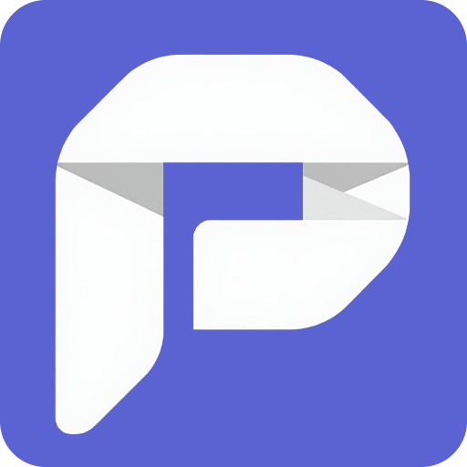

<p align="center">
  
</p>

<h1 align="center">Posthive</h1>

<p align="center">
  Schedule posts to Bluesky, Threads, Instagram, and LinkedIn from a single UI.<br/>
  Self-hostable · Open-source · AGPL-3.0
</p>

<p align="center">
  <a href="https://github.com/AstaBlackClove/posthive/blob/main/LICENSE"></a>
  <a href="https://github.com/AstaBlackClove/posthive"></a>
</p>

---

## Features

- **Multi-platform scheduling** - Bluesky, Threads, Instagram, LinkedIn
- **First comment** - post a reply/comment immediately after the main post goes live
- **Per-platform overrides** - customize text and comment per account
- **Image & video support** - up to 4 images or 1 video per post with alt text
- **Calendar view** - drag-and-drop to reschedule pending posts
- **Live status updates** - Server-Sent Events, no polling
- **Dry run mode** - full pipeline test without making real API calls
- **Onboarding flow** - guided setup after registration
- **Billing** - Dodo Payments integration with 14-day free trial, plan upgrades/downgrades
- **Settings** - profile, password change, delete account
- **Credentials encrypted at rest** - AES-256-GCM, never stored in plaintext
- SQLite locally, drop-in Postgres for production

---

## Tech Stack

| Layer | Technology |
|---|---|
| Frontend | Next.js 16 (App Router), Tailwind CSS |
| Backend | Fastify v4, TypeScript ESM |
| Database | Prisma ORM SQLite (dev) / Postgres (prod) |
| Queue | BullMQ + Redis (Upstash or Railway) |
| Billing | Dodo Payments |
| Storage | Local disk (dev) / Supabase Storage (prod) |

---

## Project Structure

```
posthive/
├── apps/
│   ├── api/                  # Fastify v4 API server
│   │   ├── prisma/           # Schema and migrations
│   │   └── src/
│   │       ├── adapters/     # Bluesky, Threads, Instagram, LinkedIn
│   │       ├── lib/          # Auth, queue, worker, encryption, storage, billing
│   │       ├── routes/       # auth, accounts, jobs, upload, billing, user
│   │       └── runner/       # Job state machine
│   └── web/                  # Next.js frontend
│       └── src/
│           ├── app/          # Pages: compose, jobs, accounts, billing, settings
│           └── components/   # Sidebar, Calendar, Previews, Toast, Modals
└── package.json              # pnpm workspace root
```

---

## Prerequisites

- **Node.js** >= 20
- **pnpm** >= 9 `npm install -g pnpm`
- **Redis** [Upstash](https://upstash.com) free tier or Railway Redis

---

## Getting Started

### 1. Clone and install

```bash
git clone https://github.com/AstaBlackClove/posthive.git
cd posthive
pnpm install
```

### 2. Set up environment variables

```bash
cp apps/api/.env.example apps/api/.env
```

Fill in the values — see [Environment Variables](#environment-variables) below.

### 3. Set up the database

```bash
cd apps/api
pnpm db:migrate
pnpm prisma generate
```

### 4. Run dev servers

```bash
pnpm dev
```

- Web: http://localhost:3000
- API: http://localhost:3001

---

## Environment Variables

### `apps/api/.env`

| Variable | Required | Description |
|---|---|---|
| `ENABLE_BILLING` | No | Set to `true` to enable Dodo Payments billing and plan limits. Leave unset for self-hosted use all features unlocked with no limits |
| `PORT` | No | API port. Defaults to `3001` |
| `DATABASE_URL` | Yes | Prisma DB URL. Use `file:./dev.db` for SQLite |
| `AUTH_PROVIDER` | No | `local` (default) or `supabase` |
| `JWT_ACCESS_SECRET` | Yes | 64-char hex string for JWT signing |
| `JWT_REFRESH_SECRET` | Yes | 64-char hex string for refresh tokens |
| `ENCRYPTION_KEY` | Yes | 64-char hex - AES-256-GCM key. **Never change after data is written** |
| `REDIS_URL` | Yes | Redis connection string |
| `WEB_URL` | Yes | Web app URL for CORS and OAuth redirects. Use `http://localhost:3000` in dev |
| `THREADS_APP_ID` | OAuth | Meta app ID for Threads |
| `THREADS_APP_SECRET` | OAuth | Meta app secret for Threads |
| `THREADS_REDIRECT_URI` | OAuth | Must be public HTTPS (use a tunnel in dev) |
| `INSTAGRAM_APP_ID` | OAuth | Meta app ID for Instagram |
| `INSTAGRAM_APP_SECRET` | OAuth | Meta app secret for Instagram |
| `INSTAGRAM_REDIRECT_URI` | OAuth | Must be public HTTPS |
| `PUBLIC_API_URL` | OAuth | Public HTTPS URL of the API Meta fetches images from here |
| `LINKEDIN_CLIENT_ID` | OAuth | LinkedIn app client ID |
| `LINKEDIN_CLIENT_SECRET` | OAuth | LinkedIn app client secret |
| `LINKEDIN_REDIRECT_URI` | OAuth | Must be public HTTPS |
| `DODO_ENV` | Billing | `test_mode` or `live_mode` |
| `DODO_API_KEY` | Billing | Dodo Payments API key |
| `DODO_WEBHOOK_SECRET` | Billing | Dodo webhook signing secret (`whsec_...`) |
| `DODO_PRODUCT_CREATOR` | Billing | Dodo product ID for Creator plan |
| `DODO_PRODUCT_PRO` | Billing | Dodo product ID for Pro plan |
| `DODO_PRODUCT_TEAM` | Billing | Dodo product ID for Team plan |

Generate secrets:
```bash
node -e "console.log(require('crypto').randomBytes(32).toString('hex'))"
```

### `apps/web/.env.local`

| Variable | Required | Description |
|---|---|---|
| `NEXT_PUBLIC_API_URL` | Yes | API URL as seen from the browser. `http://localhost:3001` in dev |
| `NEXT_PUBLIC_ENABLE_BILLING` | No | Must match `ENABLE_BILLING` in the API. `false` for self-hosted, `true` for SaaS |
| `NEXT_PUBLIC_THREADS_AUTH_URL` | Threads | Full URL of the Threads OAuth start route must be HTTPS in dev (use tunnel) |

---

## Connecting Platforms

### Bluesky
1. Go to **Accounts** in the app
2. Enter your handle (e.g. `you.bsky.social`)
3. Generate an app password at [bsky.app](https://bsky.app) → Settings → App Passwords
4. Enter it and click Connect no OAuth needed

### Threads
1. Create an app at [developers.facebook.com](https://developers.facebook.com) and add the Threads use case
2. Set the OAuth redirect URI to `https://your-domain/auth/threads/callback`
3. Add your App ID and Secret to `.env`
4. Click **Connect with Threads** in the app

> In development mode, only Threads Testers can connect. Submit for Meta App Review (`threads_basic` + `threads_content_publish`) for public access.

### Instagram
1. Add the Instagram product to your Meta app
2. Set the OAuth redirect URI to `https://your-domain/auth/instagram/callback`
3. Requires a **Professional** (Business or Creator) Instagram account

### LinkedIn
1. Create an app at [developer.linkedin.com](https://developer.linkedin.com)
2. Add the **Share on LinkedIn** and **Sign In with LinkedIn using OpenID Connect** products
3. Set the OAuth redirect URI to `https://your-domain/auth/linkedin/callback`

---

## How Scheduling Works

1. Write a post in Compose, pick accounts, set a time
2. API creates a `PostJob` in the DB and queues a BullMQ job with exact delay
3. At the scheduled time BullMQ fires the job (~1 second accuracy)
4. The runner processes each platform independently:
   - Refreshes OAuth tokens if needed
   - Posts the main content
   - Posts the first comment as a reply (if provided)
5. Each step is persisted before the next crash-safe and resumable
6. Jobs page receives real-time updates via Server-Sent Events

---

## Plans

| Plan | Accounts | Posts/month |
|---|---|---|
| Creator | 3 | 400 |
| Pro | 15 | Unlimited |
| Team | 50 | Unlimited |

All plans include a **14-day free trial**. Powered by [Dodo Payments](https://dodopayments.com).

---

## Character Limits

| Platform | Limit |
|---|---|
| Bluesky | 300 graphemes |
| Threads | 500 characters |
| Instagram | 2,200 characters |
| LinkedIn | 3,000 characters |

---

## Self-Hosting

Posthive is designed to be self-hosted. By default, billing is **disabled** no Dodo account needed, no plan limits, all features unlocked for all users.

**Both the API and web env vars must match setting only one will cause errors.**

To run without billing:
```env
# apps/api/.env
ENABLE_BILLING=false

# apps/web/.env.local
NEXT_PUBLIC_ENABLE_BILLING=false
```
- No Dodo account needed, no plan limits, all features unlocked
- Onboarding skips the plan selection step
- Billing page shows a "Self-hosted mode" message

To run as a SaaS with billing:
```env
# apps/api/.env
ENABLE_BILLING=true

# apps/web/.env.local
NEXT_PUBLIC_ENABLE_BILLING=true
```
- Create a [Dodo Payments](https://dodopayments.com) account and fill in all `DODO_*` env vars
- Users go through a 14-day free trial on signup

---

## Production Deployment

1. Create a Railway project with a **Redis** and **Postgres** service
2. Deploy the monorepo Railway auto-detects it
3. Change `provider` in `prisma/schema.prisma` from `sqlite` to `postgresql`
4. Set all env vars from `.env.example` in Railway settings
5. Set `PUBLIC_API_URL` and all OAuth redirect URIs to your Railway domain
6. Set `SECURE_COOKIES=true` in the API env (required for HTTPS cookie auth)

---

## Adding a New Platform

1. Create `apps/api/src/adapters/<platform>.ts` implementing `PlatformAdapter`
2. Register it in `apps/api/src/adapters/index.ts`
3. Add OAuth routes in `apps/api/src/routes/auth.ts`
4. Add the platform card to `apps/web/src/app/accounts/page.tsx`
5. Add favicon domain in `apps/web/src/components/PlatformIcon.tsx`
6. Add char limit in `PLATFORM_LIMIT` in `apps/web/src/app/page.tsx`

---

## License

GNU Affero General Public License v3.0 see [LICENSE](LICENSE) for details.

If you modify this project and run it as a network service, you must make your modified source code available to users of that service.
