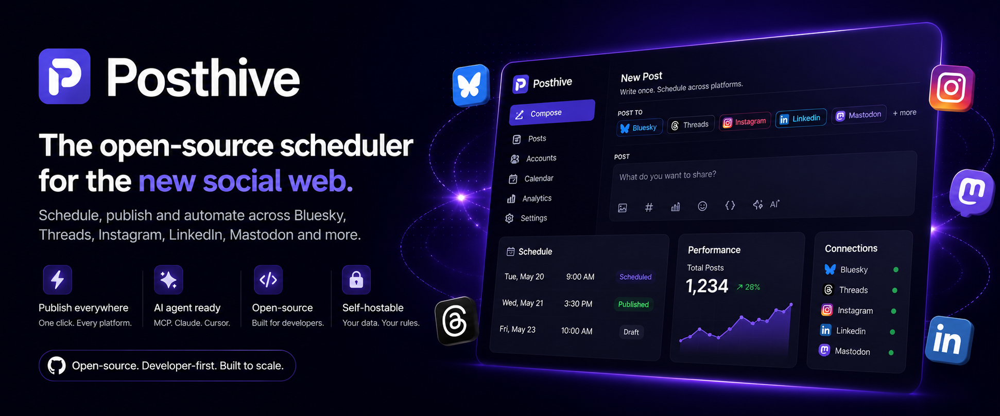

<p align="center">
  
</p>

<h1 align="center">Posthive</h1>

<p align="center">
  The agentic social media scheduling platform with built-in AI agent support.<br/>
  Schedule posts across platforms from one place self-hostable, no vendor lock-in.
</p>

<p align="center">
  <a href="https://github.com/AstaBlackClove/posthive/blob/main/LICENSE"></a>
  <a href="https://github.com/AstaBlackClove/posthive"></a>
  <a href="https://discord.gg/UEdnAtHxgN"></a>
</p>

<p align="center">
  <a href="https://posthive.co/docs"><b>📖 Docs</b></a> ·
  <a href="https://posthive.co/agent"><b>🤖 AI Agent Setup</b></a> ·
  <a href="https://discord.gg/UEdnAtHxgN"><b>💬 Discord</b></a> ·
  <a href="https://posthive.co"><b>🌐 Website</b></a>
</p>

<br/>

<p align="center">
  
  
  
  
  
  
  
  
  
  
  
  
  
  
</p>

<br/>

<p align="center">
  
</p>

---

## Features

- **Multi-platform posting** - write once, publish to 14+ platforms simultaneously
- **AI agent support** - connect Claude, ChatGPT, Cursor, VS Code via MCP; OAuth 2.0 + PKCE, no API key to paste
- **Calendar view** - FullCalendar month/week/day with drag-to-reschedule
- **Bulk CSV scheduling** - upload a spreadsheet to schedule hundreds of posts at once
- **Post templates** - save and reuse post drafts
- **First comment scheduling** - auto-reply immediately after the post goes live
- **Per-platform overrides** - custom text and first comment per account
- **Instagram Reels & Stories** - full media type support including carousels
- **YouTube Shorts & videos** - dedicated title/description fields, custom thumbnail upload
- **Dry run mode** - test the full pipeline without real API calls
- **Draft posts** - save compose state, schedule later
- **Public REST API** - full CRUD with Bearer auth (Pro/Team)
- **Self-hostable** - Docker compose, one command, billing optional

---

## Tech Stack

| Layer | Technology |
|-------|-----------|
| Frontend | Next.js 16 (App Router), React 18, Tailwind CSS |
| Backend | Fastify v4, TypeScript ESM, Node.js |
| Database | Prisma 5 + Postgres |
| Queue | BullMQ + Redis (Upstash / Railway) |
| Storage | Local disk (dev) / Supabase Storage (prod) |
| Email | Resend |
| Billing | Dodo Payments (optional) |
| Monitoring | Sentry |

---

## Quick Start (Self-hosting)

```bash
git clone https://github.com/AstaBlackClove/posthive.git
cd posthive
cp apps/api/.env.example .env
# Fill in ENCRYPTION_KEY, JWT secrets, DATABASE_URL, REDIS_URL
docker compose up -d --build
```

Open `http://localhost:3000` and register. Billing is disabled by default all features unlocked.

**Full setup guide →** [posthive.co/docs](https://posthive.co/docs)

---

## Developer Setup

```bash
pnpm install
cp apps/api/.env.example apps/api/.env
pnpm dev        # starts API + Web + Postgres (Docker)
```

| Service | URL |
|---------|-----|
| Web | http://localhost:3000 |
| API | http://localhost:3001 |
| Prisma Studio | http://localhost:5555 |

**Environment variables & platform OAuth setup →** [posthive.co/docs](https://posthive.co/docs)

---

## AI Agent Integration (MCP)

Connect any MCP-compatible AI agent to Posthive with a single URL no API key to generate or paste.

```bash
# Claude Code
claude mcp add --transport http posthive https://your-api/mcp

# Cursor / VS Code — add to mcp.json
{ "mcpServers": { "posthive": { "url": "https://your-api/mcp" } } }
```

The first tool call opens your browser to sign in. **Full setup per client →** [posthive.co/agent](https://posthive.co/agent)

**10 tools available:** `list_accounts` · `create_post` · `get_post` · `list_scheduled_posts` · `approve_draft` · `update_post` · `duplicate_post` · `delete_post` · `list_templates` · `create_from_template`

---

## Star History

[](https://star-history.com/#AstaBlackClove/posthive&Date)

---

## Community

Questions, feature requests, bugs join the Discord:

**[discord.gg/UEdnAtHxgN](https://discord.gg/UEdnAtHxgN)**

---

## License

[AGPL-3.0](LICENSE) if you modify this project and run it as a network service, you must make your source available to users of that service.
